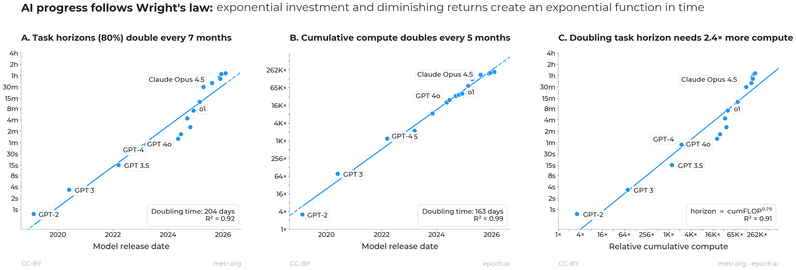
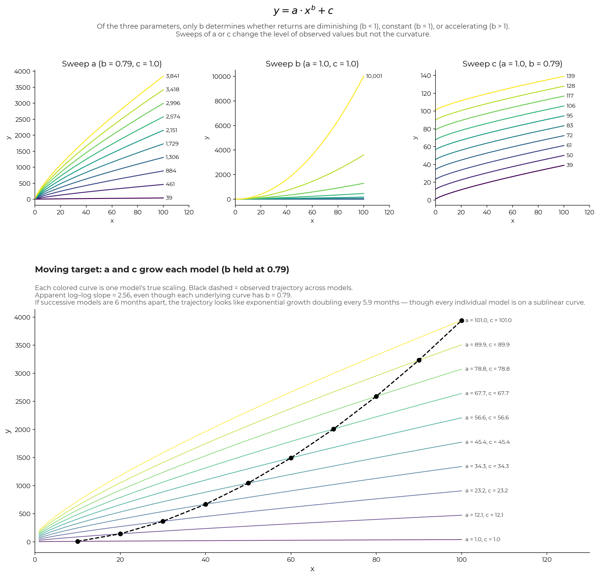
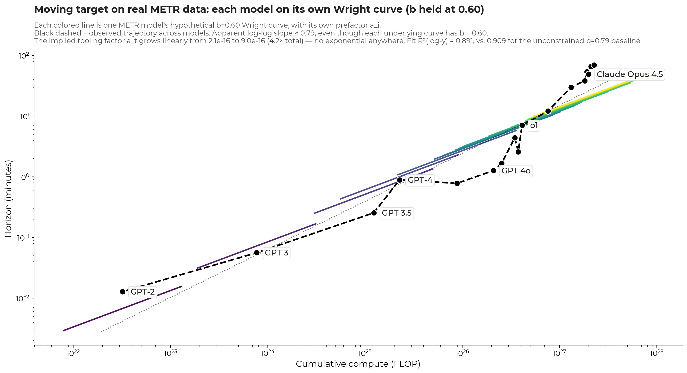

# Wright's Law in AI

A reproducible empirical analysis fitting Wright's Law to frontier AI progress. The headline finding: AI capability is a sublinear power function of cumulative computational investment, and the visible time-doubling curve is exactly what you get when investment is itself growing exponentially — Sahal's 1979 identity, the same mathematical relationship that has held for every industrial technology anyone has measured since Wright described it in 1936. AI, in other words, is a normal technology.

**Companion to:** [insert essay link]

## The headline result

Across 17 frontier-SOTA models from GPT-2 (2019) through Claude Opus 4.6 (early 2026), using METR's **80% task-completion horizon** as the capability metric:

- **METR task-time horizon (80%) doubles every 204 days** (R² = 0.92).
- **Cumulative frontier industry compute doubles every 163 days** (R² = 0.99).
- **Horizon ∝ cumulative FLOP ^ 0.79** (R² = 0.91).

In 1979, Devendra Sahal described [an algebraic relation](https://dspace.mit.edu/handle/1721.1/103015) between investment and production over time. If industrial output is a sublinear power function of cumulative investment, and if cumulative investment grows exponentially in time, then industrial output will look like an exponential function of time — at a rate equal to the power-law exponent times the rate of input growth. Plug the values above into Sahal's identity: predicted horizon-doubling = 163 / 0.79 = **206 days**. Observed = **204 days**. The identity closes to within two days. AI progress, in other words, can look like textbook exponential growth in time while simultaneously demonstrating textbook diminishing returns to investment — and these are the same fact viewed through different axes.

The compute-doubling pattern is not a recent observation. [Epoch AI](https://epoch.ai/blog/training-compute-of-frontier-ai-models-grows-by-4-5x-per-year) has documented per-model frontier training compute doubling roughly every 5.7 months since the start of the deep learning era in 2011 — a 14-year regularity. Verified directly from their corpus: n = 81 frontier-class models published 2011–2025, doubling time = **165 days** (5.4 months), R² = 0.97. So the exponentially growing investment that drives the visible time-curve is itself one of the longest-running empirical regularities in computing — not a recent observation.



### Why 80% rather than 50%?

METR publishes both p50 (50%-reliability) and p80 (80%-reliability) horizon estimates for every model. We use p80 throughout for two reasons:

1. **It's the more natural threshold.** "How long a task can the model finish 50% of the time" is a weird cutoff — it's literally the median of pass-or-fail. 80% is a much more standard reliability threshold for capability claims; it's also the conventional power level used in statistical power analysis.
2. **The data is slightly cleaner.** R² values are nearly identical at both thresholds (0.92 vs 0.94 on the time-curve, 0.91 on the Wright fit either way), but the p80 fit is marginally tighter and Sahal's identity closes within 2 days rather than 3.

The qualitative result is identical at either threshold — sublinear power law, identity closes, no sign of regime change — and the p50 numbers are reported as a robustness check below. No one with a stake in the AI debate could plausibly believe the p50/p80 distinction matters, except insofar as p50 paints AI progress as slightly faster.

## Why this matters

The standard framing of the AI debate is "will AI hit a wall, or will the scaling laws hold?". This is a false dichotomy. The scaling laws *are* the wall — which is to say that they are precise mathematical formalizations of exactly how diminishing the returns to compute are going to be. The laws *holding* is exactly the diminishing returns. If AI growth has been surprising, it's only because investments outpaced our expectations.

This analysis makes that claim quantitative. The same identity that has held for airplanes (since Theodore Wright's 1936 paper *Factors Affecting the Costs of Airplanes*), for solar PV, for beer, for refined cane sugar, for monochrome television, and for every other industrial technology anyone has measured, holds here too, on the most-cited capability curve in the AI discourse.

The Wright fit has one big implication: the scary exponential in AI isn't the capability one — it's the investment one. Capability is sublinear in cumulative compute. Cumulative compute itself has been growing exponentially for over a decade. So the visible time-curve continues only as long as the investment curve does, and the investment curve cannot continue doubling forever — eventually energy, capital, or chip supply puts a ceiling on it.

People seem to assume that recursive self-improvement will somehow change the rules of technological progress. It's possible! But I don't see anything in any data to support it. Labs have been training AI on the problem of producing better AI for almost a decade — meta-learning, learned optimizers, neural architecture search, AlphaChip (RL on chip layout, now used in every Google TPU), AlphaTensor (RL on matrix multiplication algorithms), LLMs trained on writing better training code. None of it has cascaded. All of it has produced normal incremental gains that landed on the existing Wright curve, alongside everything else. Once you automate any step of the AI-development pipeline, the most that happens is that you move down the exponential investment curve more quickly — which is to say, you exhaust your finite chip supply, your finite energy, and your finite capital *faster* than you otherwise would have.

And if the claim instead is that AI is somehow going to flip the Wright exponent from sublinear to superlinear, well, the empirical base rate for that across all measurable industrial technologies in the last century is literally zero — a tough claim to make while maintaining one's commitment to Bayesian rationality with a straight face. If we are going to see this flip, why is the threshold "automation"? Or "human-level intelligence"? AI development has been automated in various ways for many years and none of those automations cascaded. Human-level intelligence is arbitrary; there is nothing about biological evolution that selected for the threshold the AI-takeoff literature places it at. If the claim is that AI is special, you need some argument for why. And if that argument is "recursive self-improvement will flip the exponent," that's possible — sure — but you need an argument for why we should expect that, given no empirical precedent (other than "well, it'll flip because AI is special").

A related counter — *but the rate of doubling is increasing!* — sounds more empirically interesting, but is currently undecidable, and worth thinking through carefully because it's the strongest available version of the "AI is accelerating" claim.

The whole claim depends on the METR curve showing what looks like an accelerating exponent. But METR's confounds run in the same direction as that apparent acceleration: scaffold-and-tool drift inflates the apparent exponent (as the simulation in caveat #1 demonstrates), and any apparent change in that exponent over time can be fully accounted for by accelerating, uncounted RL and post-training compute. Even a methodologically clean refit — one that held scaffolding and tooling constant across the corpus — would still have to separately rule out accelerating investment before attributing any residual acceleration to a regime change. So the only currently-available positive evidence for an unprecedented exponent flip is, on inspection, a dataset that cannot distinguish the regime-change story from the "investment is accelerating and tooling drift is accumulating" story.

Against a base rate of *literally zero* exponent flips across all known instances of biological or machine intelligence — including a decade of narrow AI-on-AI automation — that is not enough. The burden of proof here sits squarely with the "AI is unprecedented" camp. I don't have the data to adjudicate this myself. Some AI researchers definitely do, and they could pretty unambiguously settle the question if they wanted to. Until they do, priors alone should push you toward the "AI isn't special until I see evidence otherwise" camp.

## Method

**Data sources:**
- METR Time Horizon 1.1 benchmark (`metr.org/assets/benchmark_results_1_1.yaml`) — 17 frontier-SOTA models with 80% task-time-horizon measurements (p50 used as robustness check).
- Epoch AI frontier models corpus (`epoch.ai/data/ai-models`) — training compute for all frontier-class models published 2018–2026, summed cumulatively at each METR-model release date.

**Fits:**
- *Panels A, B (capability vs. time, cumulative compute vs. time):* OLS on `ln(y) ~ date2num(release_date)`, doubling time = `ln(2) / slope`. This matches METR's own `fit_trendline()` procedure.
- *Panel C (Wright form, capability vs. cumulative compute):* OLS on `ln(horizon) ~ ln(cumFLOP)`, giving the Wright exponent directly. Note: log-log OLS is the correct power-law fit when data spans multiple decades; `scipy.optimize.curve_fit` in linear space gives a misleading R² because the largest points dominate the residual sum of squares.

## Methodological caveats — important

The Wright exponent of 0.79 is an **upper bound** on the true model-capability exponent. Three reasons:

1. **METR re-evaluates each model with updated tooling.** Scaffolding, prompting, tool access, agent harness, browser use, eval-set composition, and elicitation effort all change across the 17 models in the corpus. This is fine for METR's stated goal — tracking what the current frontier can do — but it means any regression on the resulting curve is fitting a moving target. Standard "hold confounds constant" methodology is not satisfied. A methodologically clean fit (fixed scaffold, fixed prompting, fixed tool access) would almost certainly produce a smaller exponent, probably in the 0.4–0.6 range — putting AI squarely in the industrial-technology pack (see *comparison* below).

   The shape of `y = a·x^b + c` is controlled by three parameters, but only b determines whether the underlying mechanism has diminishing returns (b < 1) or accelerating returns (b > 1). Sweeping a or c only changes the level of the observed values — it doesn't change the curvature. So when METR's reported curve looks steep, the question is whether b is genuinely large, or whether a and c have drifted upward (from tooling, scaffolding, harness improvements) and produced the appearance of acceleration.

   To make the confound concrete: suppose each model's true scaling follows y = ax^0.79 + c (i.e., a Wright's-law-sublinear curve with exponent 0.79), but the prefactor a and intercept c grow with each successive model because scaffolding and tooling improve. The figure below simulates 10 such models. Every individual curve has exponent 0.79. But the observed trajectory across the models — what an analyst would see plotting one point per model — has an apparent log-log slope of ~2.56, about 3× the true exponent. If successive models are 6 months apart, this confound alone produces an apparent doubling time of ~5.9 months — virtually identical to METR's published doubling rate — with zero acceleration in the underlying mechanism. Reproducible via `metr_confound_simulation.py`.

   

   This has direct implications for extrapolation. Tooling drift has natural limits: at some point you've exhausted the easy harness improvements, optimized the scaffolding, fully elicited what the underlying model can do. Once a and c stop growing, the only source of capability gain left is the true exponent b — which is sublinear. So if some fraction of METR's apparent doubling rate is being driven by tooling rather than the underlying scaling, that fraction cannot be extrapolated indefinitely. The curve will eventually bend toward whatever the true b actually allows, and the apparent acceleration will resolve into something closer to the industrial Wright pack.

2. **Epoch's published training compute is mostly pre-training only.** For reasoning-class models (o1, o3, Sonnet 3.7, etc.), RL post-training is a non-trivial fraction of total compute — up to ~50% for the latest reasoning models. The script applies multipliers (1.3–1.5×) to Epoch's pre-training numbers for these models. Documented in `RL_TOTAL_MULTIPLIER` in the script.

3. **Closed-model FLOP estimates are imputed.** Epoch flags many closed frontier-class releases as `>1e25 FLOP` without publishing precise estimates. The `IMPUTED_FRONTIER` block in the script gives explicit values for 15 such models, drawing on Epoch blog posts, public lab statements, and consistency with neighboring releases. We include them as the best available estimates of where frontier compute has actually been; all imputed values are documented in the script with rationale. *But the fit does not depend on this choice.* Cumulative compute is dominated by the largest, most-recent training runs — one frontier model in 2026 represents roughly 350× the total frontier compute spent in the entire industry before 2020, and about 5× the total spent before 2023 — so the precision of any individual imputed value contributes very little to the cumulative sum. Concretely: dropping all 15 imputed values entirely and refitting on Epoch-published numbers alone gives Wright exponent **0.82** (vs. 0.79 baseline), R² = 0.91 (unchanged), and Sahal's identity closing within 2.2 days (vs. 2.1 baseline). Doubling or halving the imputed values keeps the exponent in the 0.77–0.82 band and the identity within 3 days. The imputed numbers are only in service of giving the most justifiable estimate, and the Wright's-law fit remains qualitatively unchanged whether they are included or not.

**The 0.79 exponent should therefore be read as "the inflated estimate."** The substantive claim — AI output is a sublinear power function of cumulative compute, and the visible exponential in time is what that produces when investment grows exponentially — is robust to all three caveats. The specific number is not robust to its first decimal place.

## Identification: b is not separately determined from tooling growth

The previous caveat shows that scaffold/tool drift produces apparent exponents inflated above the true model-capability exponent. We can pin down how big that inflation could be by directly fitting the METR series with b held fixed at various sublinear values, asking what trajectory of a_t (the per-model prefactor) would be needed to explain the data — under the constraint that a_t grow at most *linearly* (or as a sublinear power law) in time. Exponential growth in a_t is disallowed: if the whole point is that AI is not exponential, invoking exponential tooling growth to recover the apparent exponential is self-defeating.

The result, fitting with c = 0 (so all growth has to come from a or compute):

| Fixed b | a-growth shape | R²(log-y) | Total a-growth over 7 yr | Interpretation |
|---|---|---|---|---|
| 0.79 | constant | 0.909 | 1.0× | The unconstrained joint fit. All apparent growth attributed to compute scaling. |
| 0.70 | linear in t | 0.905 | 2.0× | Tooling roughly doubled over 7 years. |
| **0.60** | **linear in t** | **0.891** | **4.25×** | **Tooling quadrupled — squarely plausible. b sits in the industrial Wright pack.** |
| 0.50 | linear in t | 0.865 | 9.3× | Tooling 9× — still plausible given what scaffolding has actually done. |
| 0.40 | linear in t | 0.826 | 20× | Constraint starts to bite; harder to defend. |
| 0.30 | linear in t | 0.772 | 45× | Linear growth no longer enough; fit visibly worse. |

The headline finding: **b = 0.60 with linear (~4×) growth in a fits METR essentially as well as b = 0.79 with no tooling growth at all.** The R² difference is 0.018. The data alone cannot tell these scenarios apart.



In the figure above, each METR model gets its own hypothetical Wright curve at b = 0.60, with a prefactor a_i that grows linearly across models (the short colored segments). The 17 data points lie on their respective curves. The black dashed line connects them — that's the observed trajectory across models — and its apparent log-log slope (~0.79) is noticeably steeper than the underlying 0.60. The dotted line shows the apparent slope explicitly. **No exponential growth anywhere. No regime change. Just b = 0.60 with mild linear scaffolding improvement of ~4× over seven years**, which is, if anything, conservative relative to what scaffolding/harness improvements have actually accomplished in the 2019-2026 window (basic prompting → reasoning models with agent loops, tool use, long context, etc.).

So the honest empirical statement is:

> **The METR series is fit nearly as well by b ≈ 0.5–0.7 with linear scaffolding improvement of a few-fold as it is by b ≈ 0.79 with no scaffolding improvement at all.** Linear (not exponential) tooling growth is sufficient. Given that scaffolding has obviously improved, the lower-b interpretation is at least as empirically defensible as the headline value — and puts AI squarely in the industrial Wright pack.

Reproducible via `b_sensitivity_simulation.py`.

## On the choice of cumulative compute

A note on what is, in some ways, the most consequential analytic choice in this analysis. The standard Wright's Law mechanism — going back to Wright's 1936 paper on airplane manufacturing — is *knowledge spillover*. Each unit produced teaches the workforce, the supply chain, and the broader industry something that makes the next unit cheaper. The relevant input quantity is *cumulative production*, because the thing being accumulated is industry-wide learning, not anything specific to a particular factory.

It's not obvious that this story should apply to AI. Compute is the obvious investment metric, but you could reasonably believe that AI capability scales with the compute used to train a *specific* model (which is what the conventional AI scaling laws — Kaplan 2020, Hoffmann/Chinchilla 2022 — describe) rather than with cumulative industry compute. That would be a perfectly coherent alternative framework, and a priori there's no obvious reason to prefer one over the other. Fitting horizon against cumulative industry compute, rather than per-model compute, is therefore a slightly weird analytic choice.

What settles it is empirical. Per-model compute explains 78% of horizon variance (see Robustness Check #3 below). Cumulative industry compute explains 91%. The 13-percentage-point gap is exactly the kind of learning-spillover signature Wright's Law predicts, and it is hard to explain otherwise: if AI weren't following the same kind of industry-wide accumulation pattern as airplane manufacturing or solar PV deployment, we would expect per-model compute to be the better predictor, not the worse one. The data agrees with the Wright/Sahal framework against the alternative, which is also why we're using it.

## Robustness checks

Three alternative specifications, reported here for transparency. Checks #1 and #2 are reproducible by running `robustness_checks.py`.

### 1. p50 horizon (50%-reliability cutoff)

The headline uses METR's 80%-reliability horizon. The 50% horizon is the more commonly quoted figure (it's what METR labels their main "task-time horizon" curve as). All numbers shift slightly but the qualitative result is identical:

| Statistic | p80 (headline) | p50 |
|---|---|---|
| Horizon doubling | 204 d (R² = 0.92) | 188 d (R² = 0.94) |
| Cumulative compute doubling | 163 d (R² = 0.99) | 163 d (R² = 0.99) |
| Wright exponent | **0.79** (R² = 0.91) | 0.85 (R² = 0.91) |
| Sahal identity (predicted vs. observed) | 206 vs. 204 d (**within 2 d**) | 191 vs. 188 d (within 3 d) |

Same form of curve, same sublinear power law, same identity-closes-tight. p50 doubling is slightly faster (188 d vs 204 d) because hitting 50% reliability is easier than 80%.

### 2. METR-17-only cumulative compute

What if you compute cumulative compute using only the 17 METR-evaluated models, rather than the full Epoch corpus?

| Statistic | Full Epoch corpus (headline) | METR-17 only |
|---|---|---|
| Horizon doubling (p80) | 204 d (R² = 0.92) | 204 d (R² = 0.92) |
| Cumulative compute doubling | 163 d (R² = **0.99**) | 147 d (R² = 0.96) |
| Wright exponent | **0.79** (R² = 0.91) | 0.68 (R² = 0.85) |
| Sahal identity | 206 vs. 204 d (**within 2 d**) | 216 vs. 204 d (within 12 d) |

The full Epoch corpus is the headline because Wright's Law is about industry-wide cumulative learning (papers, techniques, employee mobility, dataset curation, etc.) — not just the slice METR happened to evaluate. Frontier compute spent on, say, LLaMA-3 contributed to industry knowledge even though METR didn't run an eval on it. Restricting cumulative input to the METR-17 systematically undercounts the relevant quantity, visible in the lower R²s and looser identity check.

Qualitatively the story is unchanged either way: sublinear power law, Sahal's identity nearly closes, no sign of explosion or regime change.

### 3. Per-model (non-cumulative) compute

What if you plot horizon against each model's own training compute, rather than against cumulative industry compute? This is the Kaplan/Hoffmann scaling-laws form: capability vs. the specific training run that produced it.

| Statistic | Headline (cumulative) | Per-model (non-cumulative) |
|---|---|---|
| Form | horizon ∝ cumFLOP^0.79 | horizon ∝ FLOP^0.77 |
| R² | **0.91** | 0.78 |
| Multiplier per 2× horizon | 2.40× cumulative compute | 2.46× per-model compute |

**The exponents are similar — the R²s are not.** Per-model compute explains 78% of horizon variance; cumulative industry compute explains 91%. The 13-percentage-point gap is the Wright-Law spillover effect quantified: each new model benefits from accumulated industry learning beyond whatever its own training run contributed. Concrete examples in the data: Claude Opus 4.6 trained on the same compute as Gemini 3 Pro (1e26 FLOP) but has 3× the horizon. Claude Opus 4.5 trained on the same compute as o3 (8e25 FLOP) but has 2.5× the horizon. Same per-model compute, different horizons — because the later models came after more industry learning had accumulated.

So per-model compute is a real predictor of capability, but it's not the load-bearing predictor. The Wright/Sahal mechanism — capability scaling sublinearly with *cumulative industry input* — captures more of the variance and is the underlying regularity.

## Comparison to industrial technologies

Wright exponents (cost form, equivalent to capability form by sign flip) for selected industries, from Nagy, Farmer, Bui & Trancik (2013) *PLoS One*, "Statistical Basis for Predicting Technological Progress":

| Industry | Wright exponent |
|---|---|
| Beer (1952–1968) | 0.20 |
| Refined Cane Sugar (1936–1968) | 0.32 |
| Monochrome Television (1948–1968) | 0.28 |
| Electric Range (1947–1967) | 0.29 |
| Free-Standing Gas Range (1947–1967) | 0.56 |
| **AI capability vs. cumulative compute (this analysis, p80)** | **0.79** (upper bound) |
| AI capability vs. cumulative compute (p50 robustness) | 0.85 (upper bound) |

AI's apparent Wright exponent is on the high end of the industrial range. The methodological caveats above suggest the *true* exponent (if METR's harness/scaffold confounds were held constant) is lower than 0.79 and probably overlaps the industrial range directly. Either way: different industry, different decade, same curve.

## Input substitution and the RL-slowdown question

A specific version of the "AI is slowing down" intuition that motivated longer timelines in 2024 went like this: long-horizon RL is brutally inefficient per FLOP (sparse rewards on multi-day tasks; each training episode produces one bit of feedback after a lot of compute), and we'd already burned through many orders of magnitude of cheap-to-reallocate RL compute getting from GPT-4 to o1 to o3, so further OOMs would require *building* new chip capacity rather than reassigning existing capacity. Both observations are correct. RL really is inefficient at long horizons. The cheap OOMs really did get expensive.

The mistake was identifying RL with AI progress. Under Wright/Sahal, AI progress is a function of cumulative *industry investment*, regardless of which specific input is currently absorbing it. The exponent in Wright's law is a feature of the technology; the rate of input growth determines the time-axis doubling. *Which* input is being scaled doesn't enter the equation.

Solar PV is the cleanest illustration. Its cost-per-watt has fallen ~24% per doubling of cumulative deployment for fifty years, even though the load-bearing improvement underneath has shifted at least seven times: silicon-cell efficiency in the 70s and 80s, manufacturing scale in the 90s, balance-of-system reductions in the 2000s, Chinese capacity buildout in the 2010s, next-generation cell architectures (PERC, then TOPCon, then HJT) since. The aggregate cost curve never noticed any of the transitions. Each generation, whichever lever was cheapest got pushed.

AI is doing the same thing in compressed time. The cheapest lever has shifted multiple times since 2017:

- **2017–2018**: transformer architecture (Vaswani et al.) replacing LSTM/RNN
- **2019–2020**: pure-scale pretraining (BERT, GPT-2, GPT-3); Kaplan scaling laws
- **2022**: instruction tuning + RLHF (InstructGPT, then ChatGPT)
- **2023**: mixture-of-experts and long-context engineering (GPT-4-class, Claude 100k, Gemini 1M)
- **2024**: synthetic data with verifiers (data-wall mitigation)
- **late 2024**: test-time compute via RL on chain-of-thought (o1, then o3)
- **2025–2026**: harness and scaffolding engineering, longer agent loops

The METR doubling time stayed roughly constant across every one of these shifts. The cumulative-compute doubling time stayed roughly constant too. The Wright exponent — to the extent we can pin it down — has not shifted.

So the RL-slowdown intuition wasn't wrong about RL. It was wrong to think AI progress was about RL. Whichever input gets expensive, labs find the next cheap one and push it; the aggregate curve is invariant under the substitution. Spud or Mythos being good in 2026 is not evidence of regime change — it is evidence that the checks are still going up, and that the next cheap lever was already lined up by the time the previous one (test-time compute) started looking expensive.

## Reproducing

```bash
git clone https://github.com/vladchituc/wrights-law-in-AI.git
cd wrights-law-in-AI
pip install -r requirements.txt
python wrights_law_in_AI.py
```

The script reads from `data/` and writes to `figures/`. Should produce the panel figure plus printed fit statistics in under 30 seconds.

## Files

- `wrights_law_in_AI.py` — main analysis script (full Epoch corpus method)
- `robustness_checks.py` — alternative specifications (METR-17 only, per-model non-cumulative)
- `data/metr_benchmark.yaml` — METR Time Horizon 1.1 corpus
- `data/frontier_ai_models.csv` — Epoch AI frontier-model corpus
- `figures/wrights_law_in_AI.png` — three-panel figure
- `requirements.txt` — Python dependencies

## License

Code: MIT. Figure: CC-BY 4.0. Data attribution: METR (CC-BY), Epoch AI (CC-BY).

## Citation

```
Chituc, V. (2026). Wright's Law in AI: empirical fit on the METR task-horizon benchmark.
https://github.com/vladchituc/wrights-law-in-AI
```
